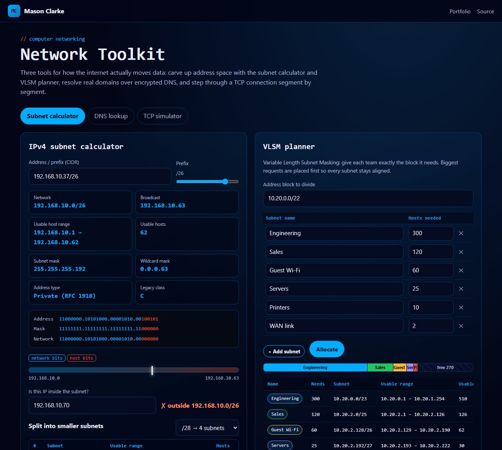
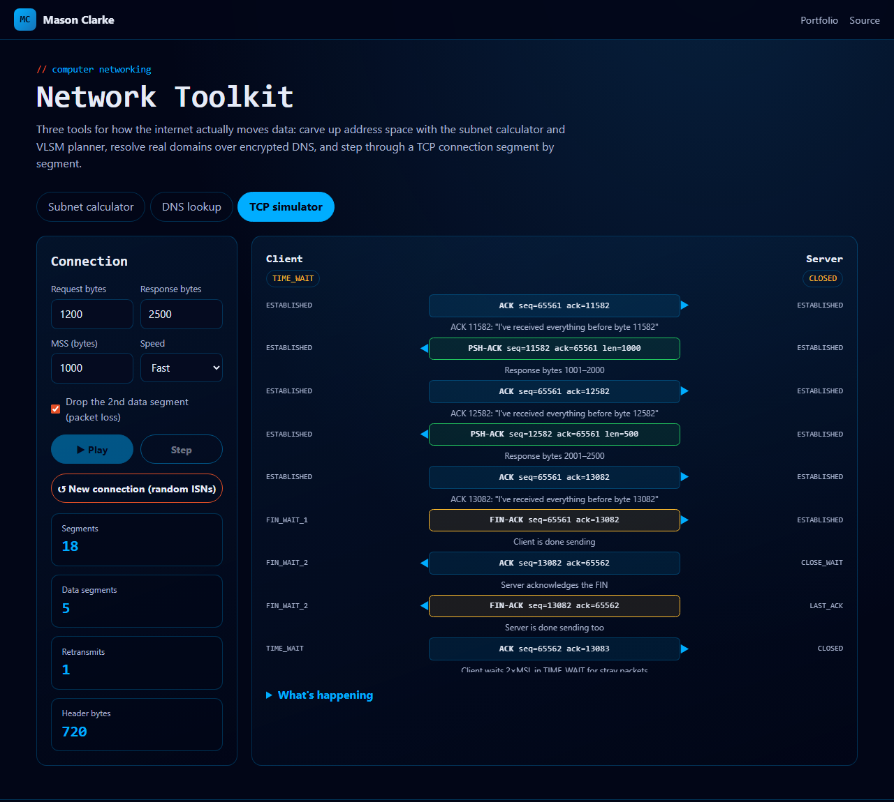

# Network Toolkit

[](https://github.com/Masons-coding/network-toolkit/actions/workflows/ci.yml)

**Live demo → https://masons-coding.github.io/network-toolkit/**

Three interactive tools for the fundamentals of computer networking: an **IPv4 subnet calculator and VLSM planner**, live **DNS-over-HTTPS** lookups, and an animated **TCP connection simulator**.



## Tools

### Subnet calculator
- Network, broadcast, usable range, mask and wildcard for any CIDR, including `/0`, `/31` point-to-point links (RFC 3021) and `/32` host routes
- Colour-coded binary breakdown of network vs host bits, and where the address sits in its block
- Classifies special ranges: RFC 1918 private, loopback, link-local, CGNAT (RFC 6598), multicast and reserved
- Splits a network into equal subnets and checks whether any IP belongs to it

### VLSM planner
Give it an address block and a list of teams with host counts. It sizes each subnet (hosts + network + broadcast), places the **largest first** on aligned boundaries, and shows spare addresses and free space.

### DNS lookup
Resolves real domains through Cloudflare's **DNS-over-HTTPS** (RFC 8484) resolver: A, AAAA, CNAME, MX, NS, TXT, SOA, CAA and HTTPS records, with TTLs, response codes (NOERROR, NXDOMAIN, SERVFAIL) and DNSSEC validation status. The page's CSP only allows network requests to `cloudflare-dns.com`.

### TCP simulator


Steps through a full connection: the **three-way handshake** with random ISNs, MSS-sized data segments with **cumulative ACKs**, optional **packet loss and retransmission**, and the **four-way close** with every endpoint state (SYN_SENT → ESTABLISHED → FIN_WAIT_1 → … → TIME_WAIT).

## Tests

14 unit tests (Node's built-in runner, run in CI):
- Address parsing, masks, and `/25`, `/31`, `/32`, `/0` edge cases
- Special-range classification (e.g. `172.32.0.1` is *public*, just outside `172.16.0.0/12`)
- VLSM placement and out-of-space errors
- DoH request construction with a mocked `fetch`, and response parsing
- TCP sequence and ack arithmetic (SYN and FIN each consume one number), MSS segmentation, and same-sequence retransmission

```bash
npm test
npx serve .
```

## Concepts

IPv4 addressing, CIDR and bitwise masking · subnetting and VLSM · the DNS hierarchy, record types, TTL caching, DoH and DNSSEC · TCP reliability (sequence numbers, cumulative ACKs, retransmission), connection state machine, TIME_WAIT

---

Built by [Mason Clarke](https://masons-resume-website.netlify.app) · [LinkedIn](https://www.linkedin.com/in/mason-clarke/)
